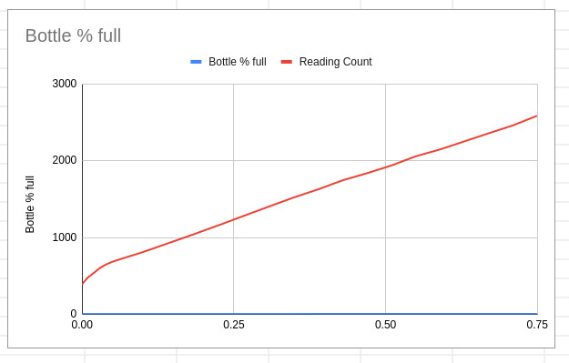
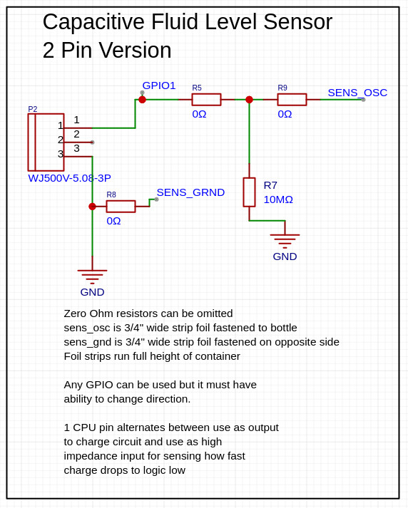
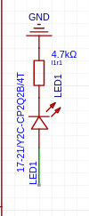
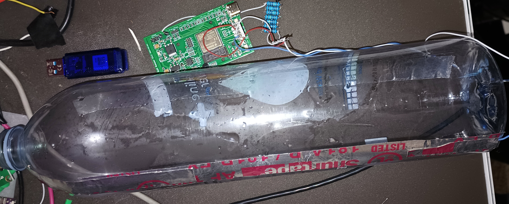
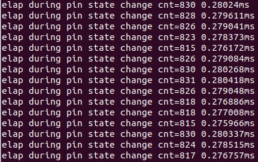
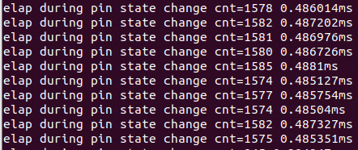
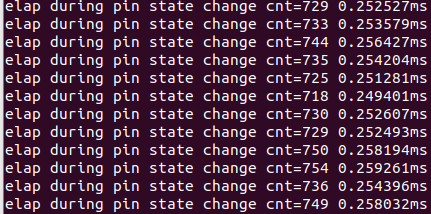
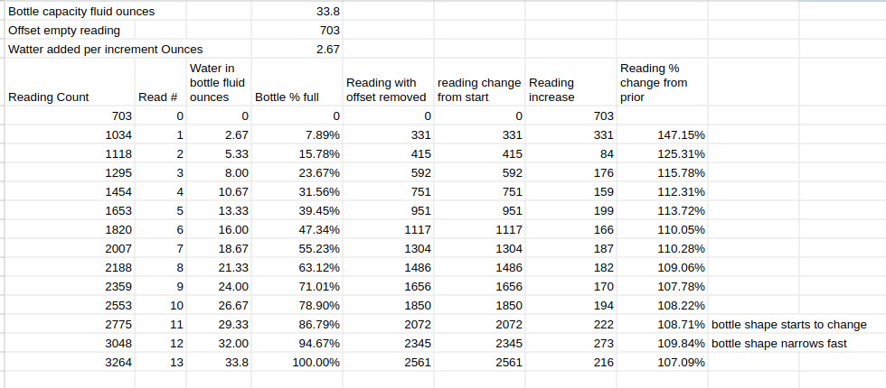

# Measuring Capacitance with Rust on ESP32 CPU using 1 Pin 

## ESP32 Embedded Rust: Measuring Capacitance with Discharge Time

This example demonstrates measuring changes in capacitance by recording the time it takes for a variable capacitor to discharge by measuring the time the capacitor takes to 
drop from VCC (3.3V) to 0.7V through a known resistor. 

### Fluid Level Sensing in Embedded Rust on ESP32 CPU by measuring change in Capacitance
For testing the electrode will be a two foil strips afixed to 
the outside of a water bottle.  The Capacitance is varied by filling the bottle with various amounts of water.  One stip oscilates from VCC to 0.7V while the other on the opposite side of bottle is connected to ground.  This forms a capacitor with air as the dielectric when empty and water as the dielectric as water is added.

### Human Proximity Sensing. 
This method can also be used to sense human touch. With a large enough sensor, it can detect changes in human proximity as a person moves closer to or further from the sensor.

### ESP32 Rust Features Demonstrated:
    - Change GPIO Pin Direction
    - Read GPIO Status
    - Using Polling to detect GPIO status change    
    - Measure elapsed time in Nanosecods
    - Delay for Micro seconds    
    - Delay for Milli seconds
    - Disable debug logging
    - Isolate pin Assignments for each change between boards
    - Converting ints to floats for calcs
    - specifying float constants

#### Please See our [2 pin variable cap read example](../ex-gpio-measure-time-to-change-high-to-low) - It is similar but uses 2 pins to avoid the need to change pin direction.

Early testing of this version shows that either Rust
or EPS32 S3 is adding sufficient random time delays
when changing pin direction that results are erratic.
Using 2 pins one for sensing and one for drive helped
remove the erratic timing.

I think the erratic timing on pin change may be caused 
by the debug or logging stubs so keeping this example 
for when we figure it out. In therory it should take 
longer to drain a capacitor from 3V to 0.7V than it
takes to charge it from 0V to 3.3V so this version should
be able to operate with lower resistor values and/or 
slower CPU speeds without sacrificing accuracy.

### Source
- [Rust source main.rs](src/main.rs)
- [Cargo.toml](Cargo.toml)
- [Capacitive fluid level sensor schematic](../ex-gpio-measure-time-to-change-high-to-low/Capacitive-Fluid-Level-Sensor-schematic.epro) for easyEDA pro.

### WHY
Many of my designs rely heavily on capacitive sensing. However, not all my preferred CPUs, such as the ESP C2 and RP2040, have built-in touch sensors. Although the ESP32 does, existing Rust libraries (esp-idf-hal and esp-hal) currently lack Rust-safe wrappers for this functionality.

Tested on esp32-s3-mini-1 on custom RaimAmp.com board on 2024-04-20

### Results and Notes
I'm pretty happy with the linearity and response. There are some variations, but these could easily be caused by my imperfect cutting of the foil tape and the use of a measuring cup and syringe to add water.

There is a significant jump in readings from an empty bottle to a bottle with some water. This jump needs to be accounted for when using this method to measure tank level.

Additionally, the readings accelerate at the end when the bottle tapers. It probably would have been better to stop at 85% full and adjust the total capacity downward.

Even with tanks of variable shapes, interpolation from point to point can be used for accurate estimation.

- Aluminum tape used as sensors was cut by hand and has some minor wrinkles, which will cause some variability in readings. 

- There is a large increase from empty to the first water increment. This is great if you want to measure an empty tank, but it makes the first reading appear skewed. 

- After adding water, some inevitably splashes on the sides, causing higher readings that drop until they reach a baseline after the water has a chance to run down and the sides dry a little. I wasn't perfectly consistent when waiting for this to happen, so some variability was introduced. 

### Steps:

1. Drive discharge pin Low and provide enough time for the circuit to fully discharge.  This is critical because any residual charge will affect 
timing in future steps.
1. Change ping to drive High 
1. Allow to charge for a fixed and exact amount of time set to allow 
   charge to very near 3V. Error on longer rather shorter to deliver
   most consistent results. 
2. Change the pin's drive mode to high impedance Read status.
3. Measure the time it takes for a high impedance input pin to discharge
   from 3.3VV to logic low approx 0.7V
4. Use fast polling to detect when the circuit Pin state changes 
   from high to low. 

### Theory:

Assuming resistance and charge level remain constant, an increase in capacitance should result in a longer time 
to charge circuit before it reaches the transition voltage. Conversely, a decrease in capacitance should lead to a shorter charge time.   

Time to discharge 4pf capacitor through 5M resistor from 3.3V to 0.7V is 29 micro seconds. This should be easy to sense from a CPU running at 120Mhz with 1% sensivity to change but when using slower CPU cycles such as a 16Mhtz MSPM0 
we would need to increase resistance to provide sufficient CPU cycles to count accurately. 
- [../discharge-time-to-capacitance.py](discharge-time-to-capacitance.py)
- [../time-to-discharge-capacitor.py](time-to-discharge-capacitor.py)

### See Also: 
   - https://github.com/esp-rs/esp-idf-hal
   - https://docs.esp-rs.org/esp-idf-hal/esp_idf_hal/
   - https://github.com/esp-rs/esp-idf-hal/tree/master/examples

# Setup
-  See wiring capacitive sensor below

## Expected Wiring

  #### CPU Pin Assignments
  - LED1 - LED Pin on GPIO-11
  - SENS1- GPIO pin used as sensor On GPIO-1
  
      
  #### Wiring 
  - GPIO Pin ->  LED ->  4.7K resistor -> GND
  - Sense1 -> 10M 0.1% resistor -> GND
  - Sense1 -> Alumimum Foil or Tape strip affixed outside of bottle
              Some foil has plastic coating make sure you have zero 
              Ohm measued from connecting wire to Foil. 
  - Sense_GRND -> GND

  #### Capacitive Sensor schematic
  
  
  #### LED Schematic
  

  I used GPIO 11 for LED on a my custom board.  You will need to find the 
  LED pin for your board and change code to match.

## Running Under Rust
Assuming you installed the Rust Tool chain 
as explained in [linux install](../../linux-install.md)

    # Source this file in every terminal opened
    export IDF_PATH=~/esp/esp-idf
    source $HOME/export-esp.sh
    source $HOME/esp/esp-idf/export.sh
    
    # change directory to location where this 
    # example has been cloned.  
    cd ~/rainampmp/firmware/rust/examples/ex-basic-uart-rs485/

    # Plug in Board 

    # Cargo build will build without trying to flash
    cargo build

    # Cargo run will build, attempt to flash and 
    # open a serial monitor displaying print statement
    # output back to the console. 
    carg run 

## Picture of Circuit board 
I did not have a 8M resistor available but did have a bunch of 1M resistor so soldered them in series to make a 8M resistor.  The RainAmp PCB did not include this capability but I did have extra pins reserved for capacitive sensing so reused them. 

- This Board Features
  - ESP32 S3 Mini 4MB firmware, 2MB PS RAM
  - Power regulator handeling input between 4.5 to 36V
  - DS1820B Temperature sensor
  - I2C pinout with pullups in place
  - 1/2 duplex RS485 transceiver with optional termination
  - 1 Wire header with pullup can repurpose if desolder pullup
  - dht22 header with pullup  can repurpose if desolder pullup
  - 15 Amp low side Motor Driver with activity LED and large buffer capacitors
  - Jtag sel, romp print, spi voltage broken ready header & jumper
  - JTAG connector pins can be repurposed if JTAG not needed
  - 10 available IO pins most with ADC and touch capability
  - 3 pins reserved for capacitive sensing can be repurposed
  If others could benefit from this board then let know what they 
  would be worth to see if we could afford to make them available.
  info@rainamp.com
  

## Picture of Bottle with electrode

## Sample Data with Bare wire no electrode

## Sample Data with Electrode on Bottle no water

## Sample Data Empty Bottle Human touching electrode sensor

## Sample Data Empty Bottle human proximity holding hand 1" from surface

## Sample Data from Water Filling a Bottle

# Notes for Improvement
- Use two flat bars close together such as 1/8" and move inside the bottle. Coat them with plastic so they can not interact electrically or corrode. 
this increases capacitance. 
- Keep wire from sensor electrode as short as possible otherwise it picks up electrical noise can can produce erratic readings.
- Need to re-run calibration readings with 1/2 once of water as starting point 
  to better isolate early bump.

The code `let mut csense_in = csenseOut.into_input()?;` converted from output pin to 
input pin and did seem to allow us to read state of the pin but it was not reliable 
due to what appeared to be glitchy timing. 

The code `csense_drv.set_low()?;` converted us from input pin back into 
an output pin but conversion seems glitchy with weird timing which
is weird because it seems to work ok in arduino.
        
# About Us 
If you find value in these examples please add a link to our main 
product site https://RainAmp.com to one or more of your sites or 
articles. Please let us know if you add links so we can reference 
them.    If you feel like donating funds to help accelerate these
examples then please contact us info@RainAmp.com    

At our small shop, we combine a deep understanding of physics and fundamental electronics to achieve results others might deem overly complex or expensive. We handle everything in-house, from designing circuits and PCBs using discrete components to writing firmware and integrating with cloud components, 
machine learning and GUIs as needed.

#### Need help accelerating your impossible project?
If others have told you your project is impossible or will take years, we can help! We excel at taking on challenges others shy away from.

#### Tired of cookie-cutter solutions?
We understand your frustration with engineers who simply slap open-source firmware on existing boards and call it a product. We offer a more tailored approach, creating solutions specifically for your needs.

#### Let's talk!
If you're looking for a team that can take your project from concept to reality, we'd love to hear from you.